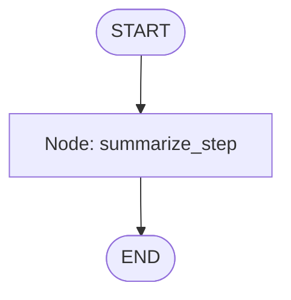
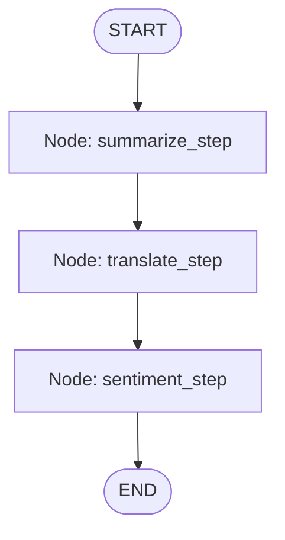

# Visual Guide
Each part shows **what the nodes are**, **what state looks like**, and **how data flows**.

> In LangGraph, a **State** is just a dictionary you pass around. A **Node** is a function that takes the state and returns an updated state. **Edges** connect nodes to define execution order.

---

## Part 1 — Tiny “Summarizer” Workflow

**State shape**

```py
class AgentState(TypedDict):
    input_text: str
    summary: str
```

**Node → Function mapping**

- `summarize` → `summarize_step(state)`: calls an LLM to summarize `input_text`, writes result to `summary`.

**Flow (START → summarize → END)**



**What happens at runtime**

1. You provide `{"input_text": "...", "summary": ""}`.
2. `summarize_step` runs, fills `summary`.
3. Graph ends.

---

## Part 2 — “Summarize → Translate → Sentiment” (Linear Pipeline)

**State shape**

```py
class AgentState(TypedDict):
    input_text: str
    summary: str
    translated_summary: str
    sentiment: str
```

**Nodes → Functions**

- `summarize` → `summarize_step(state)` → writes `summary`  
- `translate` → `translate_step(state)` → reads `summary`, writes `translated_summary`  
- `analyze_sentiment` → `sentiment_step(state)` → reads `input_text`, writes `sentiment`

**Flow (START → summarize → translate → analyze_sentiment → END)**



**What happens at runtime**

1. `summarize_step` compresses `input_text` into `summary`.  
2. `translate_step` converts `summary` to Spanish → `translated_summary`.  
3. `sentiment_step` classifies original `input_text` as **positive/negative/neutral** → `sentiment`.  
4. Done.

---

## Part 3 — Tool-Using Agent (Conditional Loop with ToolNode)

This one adds **tools** (e.g., Tavily search, date tool, flight search) and a **decision step**. The agent keeps looping: **model → (maybe) tool → model → …** until the model no longer asks to call a tool.

**State shape (message list with append semantics)**

```py
class AgentState(TypedDict):
    messages: Annotated[Sequence[BaseMessage], operator.add]
```

**Nodes → What they do**

- `agent` → Runs the LLM **with bound tools** using your function factory `make_call_model_with_tools(...)`. It produces an `AIMessage`.  
- `action` → A `ToolNode` that **executes tool calls** requested by the last `AIMessage` (if any), then returns tool results as messages.

**Router/condition**

- `should_continue(state)` looks at the **last message**:
  - If it’s an `AIMessage` with `tool_calls` → go to `action` (execute tool).  
  - Otherwise → **END**.

**Flow (START → agent ⇢ (tool?) loop → END)**

```mermaid
flowchart TD
    A([START]) --> AGENT[Node: agent (call model with tools)]
    AGENT -- has tool_calls? --> ACTION[Node: action (ToolNode executes tools)]
    AGENT -- no tool_calls --> E([END])
    ACTION --> AGENT
```

**What happens at runtime**

1. **agent**: The model decides if it needs a tool (search, date, flights, math...).  
2. If **yes**, it emits `tool_calls` → **action** runs that tool and appends the tool’s output as a message.  
3. Return to **agent** with the new context.  
4. Repeat until the model answers **without** `tool_calls` → **END**.

---